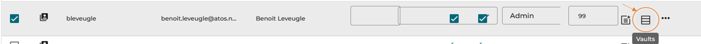
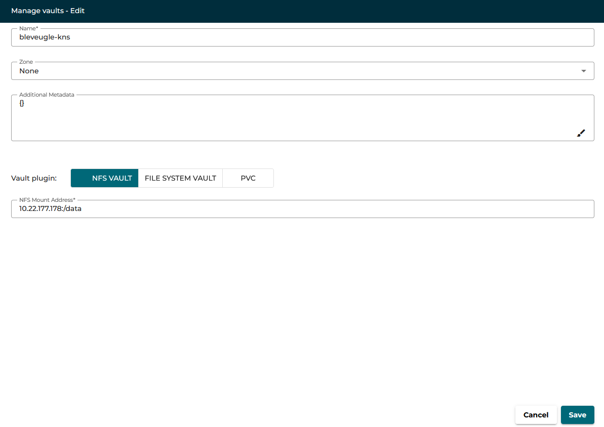

# JARVICE KNS Scheduler

KNS, for Kubernetes Nested Scheduler, allows to launch Kubernetes based apps as jobs.

## Important

Please understand that, due to its nature, the KNS scheduler needs cluster-admin rights on the target cluster to run properly.
It is STRONGLY recommanded to run the KNS in a dedicated K8S cluster, not the same than Jarvice upstream.

## Configuration

### KNS Scheduler Environment Variables

Environment|Value|Description/Notes
---|---|---
`JARVICE_KNS_KEEP_VCLUSTERS`|string|This is a debug feature. Default is `false`. If set to `true`, job garbage collector will not be called, and all resources, including vcluster, will remain as it after job is terminated. This helps a lot investigating issues during starting cycle or life of jobs.
`JARVICE_KNS_DEFAULT_LIMIT_RANGE`|string|This set the default limit range of job's namespace (so propagated to vcluster pods) using native limit range settings. The settings must be in JSON format, and passed as base64 encoded string. Default is `{"default":{"cpu": 1, "memory": "1Gi"}, "default_request":{"cpu": "200m", "memory": "256Mi"}, "type":"Container"}` which means value to set for `JARVICE_KNS_DEFAULT_LIMIT_RANGE` is `eyJkZWZhdWx0Ijp7ImNwdSI6IDEsICJtZW1vcnkiOiAiMUdpIn0sICJkZWZhdWx0X3JlcXVlc3QiOnsiY3B1IjogIjIwMG0iLCAibWVtb3J5IjogIjI1Nk1pIn0sICJ0eXBlIjoiQ29udGFpbmVyIn0=`. Note that this value is overwritten by app AppDef.json limit range if set.
`JARVICE_KNS_VCLUSTER_SPAWN_DELAY`|integer|This is the maximum time in seconds a vcluster should take to spawn. This is impacted by cluster scale up. Note that this is the delay of a vcluster start only, between the vcluster create command and the time vcluster reports the vcluster to be running not the time of in-init templates apply. Default is `300`.
`JARVICE_KNS_INIT_IMAGE`|string|Repo/image from which to grab KNS init image. Default is `us-docker.pkg.dev/jarvice/images/init-kns`. Note that if no tag is provided in this url, JARVICE_IMAGES_TAG is used. Tag to use is defined by Jarvice native `JARVICE_IMAGES_TAG` value.
`JARVICE_KNS_ALLOW_GOTTY_SHELL`|string|Allow or not, at admin level, usage of the gotty shell when launching a KNS job. Note that for a gotty shell to start, both admin and app's AppDef.json must allow it. Default is `false`.
`JARVICE_KNS_GOTTY_IMAGE`|string|Repo/image from which to grab KNS gotty image. Default is `us-docker.pkg.dev/jarvice/images/kns-gotty`. Note that if no tag is provided in this url, JARVICE_KNS_GOTTY_IMAGE_TAG is used.
`JARVICE_KNS_GOTTY_IMAGE_TAG`|string|Jarvice image tag for gotty image. Default is `n1.3.0`.
`JARVICE_KNS_DEFAULT_STORAGE_CLASS`|string|Name of the default storage class to be propagated from host kubernetes cluster to inside nested kubernetes clusters.
`JARVICE_KNS_DYNAMIC_STORAGE_SIZE`|string|Size by default to allocate to jobs that can be allocated on the `JARVICE_KNS_DEFAULT_STORAGE_CLASS`. Default is `100Gi`. IMPORTANT: set unit with the value: not `80` but `80Gi`.

The KNS also need the following standard Jarvice values:
* `JARVICE_JOBS_DOMAIN`: domain name to use for job's ingress (downstream domain name).
* `JARVICE_JOBS_INGRESS_CLASS`: ingress class (default is no specific class set for ingress).

### Keycloak setup

It is possible to enable Keycloak support so that jobs, when application needs it, can request a dedicated client id and client secret from the main Keycloak server handling the Jarvice instance.
A dedicated client must be created in the KNS dedicated realm. This client must have the rights to create other clients in its realm.

The following optional environment variables are to be set:

Environment|Value|Description/Notes
---|---|---
`JARVICE_KNS_KEYCLOAK_URL`|string|Url of the main Keycloak server endpoint /auth. For example: `https://jarvice-dummy-kc.jarvicedummy.dummy/auth`.
`JARVICE_KNS_KEYCLOAK_REALM`|string|Keycloak Realm where KNS clients will be created and where main client is setup.
`JARVICE_KNS_KEYCLOAK_CLIENT_ID`|string|ID of the dedicated client of the KNS scheduler. This client must be able to create other clients and be able to use client secrets (non public client).
`JARVICE_KNS_KEYCLOAK_CLIENT_SECRET`|string|Secret of the dedicated client of the KNS scheduler, to authenticate and get tokens.

### Configuring distant K8S cluster

#### Compute nodes taints

The KNS will run vclusters resources in dedicated nodes, using tolerations. Nodes taints must be set accordingly.

Hard coded tolerations are:

* `node-role.jarvice.io/jarvice-vcluster`
* `node-role.kubernetes.io/jarvice-vcluster`

If using GPU nodes, the following taint must also be set:

* `nvidia.com/gpu`

#### HTTPS support

Each KNS job needs its own subdomain to be accessed via ingress.

In order to enable https support on the KNS cluster, it is mandatory to set a default wildcard certificate in the ingress controler when configuring the host K8S cluster.

The following steps explain how to generate the certificate and how to set is as default certificate.

##### Setup cluster issuer

The following documentation assumes you are using letsencrypt to create the cluster certificate.

First, create a new ClusterIssuer. A cluster issuer is like a simple issuer, but not namespace limited.
For convenience, please push this ClusterIssuer in the same namespace than the KNS scheduler.

```yaml
apiVersion: cert-manager.io/v1
kind: ClusterIssuer
metadata:
  name: letsencrypt-prod
spec:
  acme:
    email: foo.bar@example.com  # <<< replace me
    preferredChain: ""
    privateKeySecretRef:
      name: letsencrypt-prod
    server: https://acme-v02.api.letsencrypt.org/directory
    solvers:
    - http01:
        ingress: {}
    - dns01:
        cloudDNS:
          project: PROJECTID  # <<< replace me
```

Set the email according to your letsencrypt account. Please note that we set here `dns01` key, since generating a wildcard certificates uses dns01 acme challenge.
Please also note that this `dns01` part is to be set according to your K8S cluster platform.

###### GKE

The example above is for GKE clusters, which uses your GKE project ID.

```yaml
    - dns01:
        cloudDNS:
          project: PROJECTID  # <<< replace me
```

Set your project ID here.

###### OVH

For OVH provider, please use:

```yaml
    - dns01:
        webhook:
          groupName: 'acme.foo.bar.cloud'
          solverName: ovh
          config:
            endpoint: ovh-eu
            applicationKey:  # <<< set me
            applicationSecretRef:
              key: applicationSecret
              name: ovh-credentials
            consumerKey:  # <<< set me
```

And set keys according to your account.

##### Generate certificate

Now that the cluster issuer is setup, you can generate the certificate.
Create a wildcard certificate resource this way:

```yaml
apiVersion: cert-manager.io/v1
kind: Certificate
metadata:
  name: kns-wildcard
spec:
  secretName: kns-wildcard
  issuerRef:
    name: letsencrypt-prod
    kind: ClusterIssuer
  dnsNames:
  - '*.example.com'  # <<< replace me
```

Note that the certificate MUST be in the same namespace than the ingress controller.

Create the certificate using kubectl, and wait for it to be ready. Creating of a wildcard certificate can take from few minutes to many hours, depending of your platform.
You can follow the certificate creation by reading descriptions of each elements: certificate will create an order, which creates a challenge.

Check that the certificate is ready by quering certificate resources in the ingress controler namespace:

```
# kubectl get certificate -n jarvice-system
NAME                                          READY   SECRET                                        AGE
kns-wildcard                                  True    kns-wildcard                                  1h
#
```

Once the certificate is ready, proceed to next step.

##### Register certificate as default certificate

Now is time to register the created wildcard certificate as default certificate in th ingress controler.

Procedure is different depending of your ingress controller:

* For Trafeik, please read: https://doc.traefik.io/traefik/https/tls/#acme-default-certificate
* For Nginx, please read: https://kubernetes.github.io/ingress-nginx/user-guide/tls/#default-ssl-certificate

Now that the ingress controler is ready to use the wildcard certificate, KNS jobs should be https ready.

##### Alternative solution

In case of it is impossible to define a default certificate on the KNS cluster (shared cluster for example), an alternative solution is to create the certificate in the KNS namespace, and then use an external tool, like kubernetes-replicator (https://github.com/mittwald/kubernetes-replicator), to synchronise the certificate secret into each KNS jobs namespace.
Then, the `JARVICE_JOBS_INGRESS_CERT_SECRET_NAME` KNS setting allows to define the secret name to be used by each ingress (each ingress will be TLS associated with the secret replicated in its namespace).

If using kubernetes-replicator, to ensure secret replication, add a specific anotation when creating the certificate:

```yaml
apiVersion: cert-manager.io/v1
kind: Certificate
metadata:
  name: kns-wildcard
spec:
  secretName: kns-wildcard
  issuerRef:
    name: letsencrypt-prod
    kind: ClusterIssuer
  dnsNames:
  - '*.example.com'
  secretTemplate:  # <<< kubernetes replicator annotation
    annotations:
      replicator.v1.mittwald.de/replicate-to: "kns-job-[0-9]*"
```

This will ensure kubernetes replicator will push the associated secret into each jobs namespace.

### Users Vault

KNS allows usage of vaults. Currently, only NFS based vaults are supported.

#### Register user's vault

In order to register a user vault, use Jarvive XE portal.
As admin, in Admininstration tab, select Users. Search for the desired user, and click on the "Vaults" icon.



Select "Create", and set vault title and mount address, in the format `IP:/PATH`. Also make sure the zone is the same than the zone where KNS cluster is configured.



Now, when a user launches a KNS application, once nested kubernetes is accessible, a dedicated storage class, named from user and vault name (`jobuser-vaultname`), will be accessible for usage, and will mount the vault on demand.
