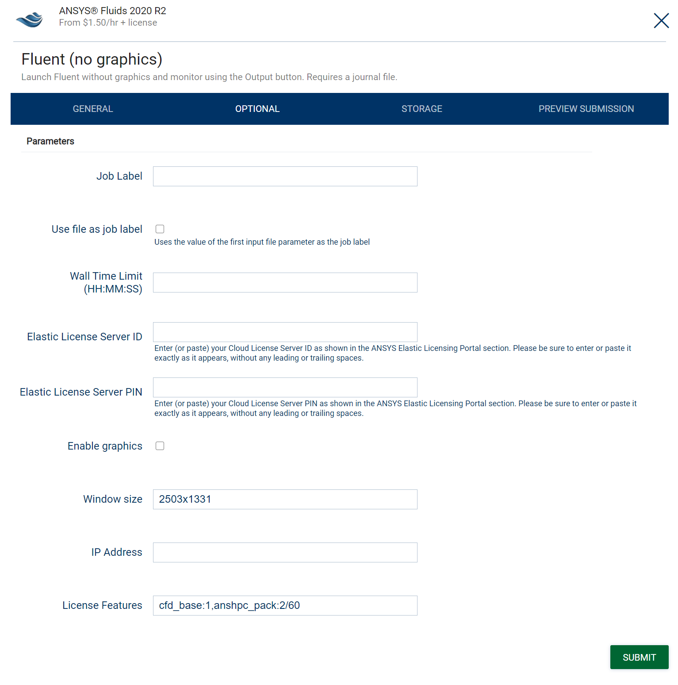

# JARVICE License Manager

A comprehensive mechanism for queuing jobs based on license token availability.

## Note about Slurm-managed compute clusters

When submitting jobs on a Slurm downstream cluster, JARVICE passes license token requests to Slurm's `sbatch` command using the `-L` flag, exactly as entered by the user at job submission time in the task builder's *OPTIONAL* tab or via the `/jarvice/submit` API's `licenses` key.  License management configuration is the responsibility of the Slurm system administrator.  For information about configuring and operating this feature in Slurm, please see [Licenses Guide](https://slurm.schedmd.com/licenses.html) in the *Slurm workload manager Documentation*.

### Additional notes

1. When combining Slurm and Kubernetes compute clusters with jobs using the same license pools, `jarvice-license-manager` for Kubernetes will automatically take into account any token checkouts that take place outside of JARVICE jobs run on Kubernetes.  Slurm's respective mechanism requires [Remote Licenses](https://slurm.schedmd.com/licenses.html#remote_licenses) to be set up for this!
2. When jobs queue for licenses on Slurm, this reason will not be apparent to end users in the portal's *Dashboard*.  Jobs will simply appear as queued with no further explanation.  Using the `squeue` command on Slurm login nodes will reveal the `(Licenses)` reason if jobs are waiting for license availability.
3. The [Automatic License Feature Computation](#advanced-automatic-license-feature-computation) feature can still be used even if one or more downstream clusters are Slurm-based.  Other advanced features, however, require Kubernetes clusters.

---

## Contents (Kubernetes compute clusters)

* [Overview](#overview)
    * [Use Cases](#use-cases)
    * [Notable Features](#notable-features)
    * [Architecture](#architecture)
* [Configuration](#configuration)
    * [Service Configuration](#service-configuration)
    * [License Server Configuration](#license-server-configuration)
    * [Multi-cluster Configuration](#multi-cluster-configuration)
* [API](#api)
* [Usage](#usage)
    * [Web Portal](#web-portal)
    * [JARVICE API](#jarvice-api)
* [Troubleshooting](#troubleshooting)
* [Advanced: Multiple License Server Addresses](#advanced-multiple-license-server-addresses)
* [Advanced: Automatic License Feature Computation](#advanced-automatic-license-feature-computation)
* [Advanced: Preemptible Features](#advanced-preemptible-features)
* [Best Practices, Anomalies, and Caveats](#best-practices-anomalies-and-caveats)

---

## Overview

The `jarvice-license-manager` component is an optional service in the JARVICE control plane (upstream) to provide support for queuing jobs based on license token availability on external license servers.  It is a cluster-wide feature intended to be used with batch, rather than interactive, jobs.

### Use Cases

Typical use cases include, but are not limited to:

* *"submit and forget"* for batch simulations - jobs will queue (rather than fail) until both infrastructure and license tokens are available
* ensuring important projects get priority for license tokens versus other projects
* maximizing cost efficiency on auto-scaling infrastructure to ensure scale-up only happens if licenses are available to run the respective jobs

### Notable Features

* Multi-cloud/multi-cluster support
* Multiple vendor/application support; allows configuration of multiple license servers to manage
* Project-based limits and overrides for tokens
* Optional feature groups and "pseudo-features" to simplify job submission
* Web-based management [API](#api)

### Architecture


The `jarvice-license-manager` web service communicates with one or more FlexNet license server(s), maintains a token cache and reservation system, and provides guidance to downstream schedulers about license availability so they can queue jobs as needed.  It is intended to be used with batch, rather than interactive jobs.

To avoid overwhelming license server(s) with traffic during periods of frequent job submission, `jarvice-license-manager` keeps a cache of available tokens and updates it periodically for all configured license server(s).  A reservation system fronts the cache, so that job submissions can "reserve" feature tokens until the respective solver checks them out from the license server.

Users (or scripts/applications via API) must specify token reservation information at the time of job submission.  This should reflect the expected license use of the solver itself once it starts.

#### Reservation Life Cycle

* If tokens are available, a reservation is created which does not expire and counts against future reservation attempts; if not enough tokens are available, the reservation fails and the requesting job queues.
* Once the job starts (e.g. infrastructure queuing and container pulling for all parallel nodes in the job is complete), expiration is update to give the solver time to perform the actual checkout; typically, this is a 60 second period but can be increased or specified by the end user during job submission.  The expectation is that the solver will perform the actual checkout within this time period, which starts the moment the application environment is ready.  Most solvers attempt license checkouts immediately upon invocation, which fits this model.
* Expiring reservations are automatically deleted on the next license server update period.
* If the job is canceled, terminated, or ends before the expiration time of the reservation, the reservation is automatically deleted since the job is no longer active.

The reservation life cycle is intended to achieve 2 goals:

1. Favor queuing rather than failure, even at the slight expense of license utilization for short periods of time during high frequency job submission.
2. Facilitate consuming license tokens from outside of JARVICE concurrently, although this is not recommended.

Generally speaking, reducing the update interval period increases license token utilization under high load at the expense of putting additional pressure on the license server(s) themselves.

#### Fault Tolerance

While the `jarvice-license-manager` component itself is stateless and can be restarted, reservations are persistent and maintained in the control plane database.  At worst case, failure of the `jarvice-license-manager` component will lead to temporary queuing of jobs that request license token reservations.  This is corrected automatically when the service resumes.  The component is deployed as a single replica Kubernetes *Deployment* and restarts automatically on failure.

#### Additional Information

* JARVICE cannot anticipate what actual license tokens will be checked out by a given solver with a given set of parameters.  This is why the reservation requests are user-initiated, and it's expected that end users understand what tokens their jobs will require.  If users do not specify any license reservation tokens at submission time, JARVICE does not attempt to apply queuing rules to those jobs.
* The `jarvice-license-manager` component has an [API](#api) that can be used to inspect internal configuration as well as license token availability as reported by configured FlexNet servers.  Note that the API requires *Ingress* to be enabled so it can be accessed from outside the control plane.

[Back to Contents](#contents)

---

## Configuration

`jarvice-license-manager` is an optional component that must be explicitly enabled in the Helm chart, and configured either by Kubernetes *ConfigMap* (deprecated), or explicitly by API method.  The JARVICE web portal also provides a user interface in *Administration->License Manager*, which is considered best practice.  Additional configuration details follow...

### Service Configuration

To enable the service, set the Helm parameter `jarvice_license_manager.enabled` to `true` on the JARVICE control plane (upstream cluster).  Additional parameters:

### On Upstream clusters only

* `jarvice_license_manager.ingressHost` - set to the FQDN to request for Ingress; note that this must be an FQDN and not a URL; `jarvice-license-manager` assumes the path to its services is `/`.  If not specified, Ingress is not enabled.  Note that Ingress must be enabled if serving a multi-cloud/multi-cluster configuration, or if direct use of the [API](api.md) is desired.
* `jarvice_license_manager.JARVICE_LMSTAT_INTERVAL` - set to the number of seconds between license server token updates (runs `lmutil lmstat` on all configured servers, and garbage collects expired reservations)
* `jarvice_license_manager.JARVICE_HOSTALIASES` - JSON, see [Adding entries to Pod /etc/hosts with HostAliases](https://kubernetes.io/docs/concepts/services-networking/add-entries-to-pod-etc-hosts-with-host-aliases/) for format.  This is needed for FlexNet license clients to properly resolve server addresses when DNS is not sufficient, as explained in [Flex server host name resolution](#flex-server-host-name-resolution).

#### If using S3-compatible object storage to serve FlexNet `lmutil` binaries from

* `jarvice_license_manager.JARVICE_S3_BUCKET` - set to the S3 bucket to fetch from
* `jarvice_license_manager.JARVICE_S3_ACCESSKEY` - set to S3 access key
* `jarvice_license_manager.JARVICE_S3_SECRETKEY` - set to S3 secret access key
* `jarvice_license_manager.JARVICE_S3_ENDPOINTURL` - set to S3 endpoint URL, if not serving from AWS

**NOTE:** `jarvice-license-manager` uses the FlexNet `lmutil` utility to query license servers.  This utility is not included in the `jarvice-license-manager` container itself and must be served using an alternate mechanism, such as S3 object storage, HTTP(s) service, or present on a file system within a derived container.  Please see [Best Practices, Anomalies, and Caveats](#best-practices-anomalies-and-caveats) for additional information on where to find application-specific `lmutil` binaries.

### On Downstream clusters only
* `jarvice.JARVICE_LICENSE_MANAGER_URL` - should be set only in downstream clusters with the full URL to reach the license manager on the control plane.  Do not set on upstream deployments as the standard service URL will be used automatically within the control plane itself.
* `jarvice.JARVICE_LICENSE_MANAGER_SSL_VERIFY` - set to `"true"` to verify SSL certificates, assuming secure Ingress.

### On both Upstream and Downstream clusters

* `jarvice.JARVICE_LICENSE_MANAGER_KEY` - set to basic HTTP authentication token; can be set to `""` to disable authentication, but must match on all upstream and downstream clusters in a deployment.  Note that the use of authentication is strongly recommended when Ingress is configured.
* `jarvice.JARVICE_POD_SCHED_LICENSE_PRE` - set to `"true"` to attempt license reservations before queuing for infrastructure availability; default is `false`, meaning after infrastructure is available (see [Best Practices, Anomalies, and Caveats](#best-practices-anomalies-and-caveats) below); this value can be set differently for each downstream cluster in a deployment, as underlying infrastructure characteristics may vary.

For additional configuration parameters, see the `jarvice_license_manager` section in [values.yaml](values.yaml)

### License Server Configuration

#### Web Portal

The best practice for configuring the license manager is to use the web portal's *Administration->License Manager* function.  Refer to the [Sample Configuration](#sample-configuration) below for additional details.

#### ConfigMap (deprecated)

A Kubernetes ConfigMap is needed in the "system" namespace called `jarvice-license-manager`.  To create this ConfigMap, create a directory called `etc`, with the file `servers.json` in it (see below for format).  Then run the following command:

```
kubectl create configmap -n jarvice-system --from-file=etc jarvice-license-manager
```

(Replace `jarvice-system` with the "system" namespace if different.)

Note that the `jarvice-license-manager` component must be restarted if the ConfigMap is changed; alternatively, it can be reloaded via the API's [/reload](#reload) method.

**IMPORTANT NOTE**: Even if a ConfigMap is present, once the web portal method is used, it will migrate the configuration to the control plane database and ignore the ConfigMap from that point forward.

#### Sample Configuration

`servers.json` specifies license servers to communicate with, pseudo-feature definition, project limits, and `lmutil` binary locations.  Note that `lmutil` itself is not distributed in this package and must be provided from an external source, such as S3 or filesystem.

```json
{
    "ansyslic1": {
        "config": {
            "name": "ANSYS_LICENSE_SERVERS",
            "value": "192.168.30.101"
        },
        "address": "192.168.30.101",
        "port": 1055,
        "binary": "s3:///flexnet/lmutil-ansys2019r3",
        "features": {
            "spaceclaim": {
                "a_spaceclaim_dirmod": 0,
                "a_spaceclaim_faceteddata": 1
            }
        },
        "projects": {
            "team1-design": {
                "a_spaceclaim_faceteddata": "25%"
            }
        }
    },
    "adslic1": {
        "config": {
            "name": "ADS_LICENSE_SERVERS",
            "value": "27009@adslic1.internal.io"
        },
        "port": "27009",
        "binary": "s3:///flexnet/lmutil-ads"
    }
}
```

The above configuration describes the following:

* 2 license servers - `ansyslic1` and `adslic1` are the Flex host names for each ones, respectively; these are typically stored in the license file itself and must be resolvable from the client - more information below
* Account variable name/value pairs that will be fed into a job needing a license from this server in the `config` key; these must match exactly what's set for a given payer in *Administration->Users* view, *VARIABLES* dialog; when a job is launched that has this account variable name/value pair, the JARVICE scheduler should ping the license manager with that pair as part of a license reservation request (if the user specified license features); `jarvice-license-manager` finds the server configuration based on that name/value pair; while the value of this variable will likely be the Flex server address, `jarvice-license-manager` treats it as opaque and application specific
* IP address or FQDN of license server in the `address` key - if not specified, the top-level key itself (e.g. `adslic1` in the example where `address` is not set) will be used - more information below
* A port number value in the `port` key - note that this must be specified separately since some JARVICE applications (e.g. ANSYS) imply the port number from their license account variable value; therefore the `jarvice-license-manager` must be told explicitly
* The `binary` key is required and specifies a URL for the `lmutil` binary to use against that license server; supported schemes are `http`, `https`, `s3`, and `file`; `jarvice-license-manager` will download each binary and then refer to it when counting licenses on that particular server during its update interval; the container is built with `redhat-lsb-core` packages to allow most known Flex clients to execute properly, and this should also be assumed to work only on `x86_64` architectures
* The `features` key is optional and is used to define "pseudo-features" that users can request at job submission time (e.g. to group many Flex features into one easier-to-remember symbolic name); subkeys are the pseudo-feature name itself (e.g. `spaceclaim`), which contain a mapping to actual Flex license features and counts; 0 means absolute 1, while non-zero values are multiplied by the counts specified by the user; in the `spaceclaim` example, if the user requests `spaceclaim:9`, the reservation will be for 1 `a_spaceclaim_dirmod` license and 9 `a_spaceclaim_faceteddata` licenses; note that users can request either pseudo features or actual features - `jarvice-license-manager` will always choose a pseudo-feature first and expand it even if it's named the same as an actual feature
* The `projects` key is optional and describes adjustments to make to maximum license reservation limits for given features; each subkey is the name of the project, prefixed with the team payer account (e.g. `design` project for `team1` payer); each subkey of that is the actual license server feature and either a maximum percentage of total (e.g. "25%") or an absolute maximum (e.g. `10`) to restrict for that project; note that these features refer to the actual Flex license feature, not a pseudo-feature that may have been defined

#### Flex server host name resolution

The Flex license server protocol requires a client to be able to reconnect to a host name that the license server thinks it's running on, which is usually specified in the license variable itself.  This needs to be resolvable from the client.  If the initial outbound address (`address` key) is an FQDN rather than an IP address, `jarvice-license-manager` will automatically create a host alias to resolve the top-level license server name (e.g. `ansyslic1`) to this value.  The top-level name must match what the Flex server thinks its host name is.  If using an IP rather than an FQDN, the top-level license server name must be resolvable using either DNS or explicit value configured via `jarvice_license_manager.JARVICE_HOSTALIASES`, which is a JSON representation of Kubernetes Pod `hostAliases` as described in [Adding entries to Pod /etc/hosts with HostAliases](https://kubernetes.io/docs/concepts/services-networking/add-entries-to-pod-etc-hosts-with-host-aliases/).

If you do not have access to the Flex license file itself to see the value of `SERVER`, you can determine this using an existing `lmutil` binary (usually supplied as an embedded componnet in a Flex-licensed application) as follows:

```
$ ./lmutil lmstat -lm -c 1055@192.168.30.101
lmutil-l34815 - Copyright (c) 1989-2015 Flexera Software LLC. All Rights Reserved.
Flexible License Manager status on Fri 12/18/2020 20:52

License server status: 1055@ansyslic1
    License file(s) on ansyslic1: 1055@192.168.30.101:

lmgrd is not running: License server machine is down or not responding. (-96,7:2 "No such file or directory")
```
Notice that the server answers and refers to itself as `1055@ansyslic1`, where `ansyslic1` is the server name.  This value must be used as the top-level key in the configuration file to define this license server, and must be resolvable from the `jarvice-license-manager` container.  During the stage of determining the server name, it is safe to ignore the error at the bottom.  Once resolvable, this command will provide successful status.

[Back to Contents](#contents)

---

## API

`jarvice-license-manager` provides a web service API for control and status.  It supports both GET and POST methods.  All response payload formats are JSON format unless otherwise specified.  API access requires Ingress to be enabled for the license server, or some other manually configured externally-accessible Kubernetes service (e.g. `LoadBalancer` type).  The following endpoints are defined...

### /servers

Returns configuration and status information for all servers, closely resembling the initial `servers.json` configuration file; note that certain keys are removed and/or adjusted for internal operation.

#### /servers/*server*

Returns configuration for a specific *server* (e.g. `ansyslic1`); notice that percentages reflecting feature max allowance in the optional `projects` scope are expressed as negative numbers - e.g. `"25%"` becomes `-25` internally; positive numbers refer to an absolute maximum.

#### /servers/*server*/lmstat

Runs the `lmutil lmstat -a` command against the specific *server*; note that this is performed on-demand and out of cycle with `jarvice-license-manager`'s periodic updates; return content-type is `text/plain` rather than `application/json` as with other methods.

#### /servers/*server*/reservations

Lists reservations currently active against the specific *server*.

### /configs

Lists server configuration grouped by name/value pair for account variables - e.g. `ANSYS_LICENSE_SERVERS=192.168.30.101`.  This is an index into the information available with the `/servers` endpoint.

#### /configs/*config*

Lists server configuration for a specific name/value pair (specified in *config*).

### /configure

Without arguments, returns the current configuration in JSON format.  If the `config` argument contains valid JSON, it applies that configuration immediately and updates license server cache.

### /reload

Reloads `servers.json` configuration; note that a failure (e.g. all license server configurations invalid) will cause the web service to terminate; use this endpoint to reload after applying changes to the `jarvice-license-manager` Kubernetes ConfigMap.  This endpoint also updates license counts for each configured server, even if performed outside the configured interval.

**NOTE**: configuring via ConfigMap is deprecated; use the [/configure](#configure) method instead, which loads and stores configuration in the control plane database.

### /update

Updates license counts for all valid configured servers immediately, even if called outside the configured interval.

### /gc

Garbage collects expired reservations immediately, even if called outside the configured interval.

### /reserve

Creates or updates reservations.  Parameters are as follows (GET or POST):

* `rsvid` - reservation ID, must be globally unique; in JARVICE this will be a job number
* `project` - optional project name to associate with reservation, used to calculate maximum available licenses; note that the project name should contain the payer account prefix (`<payer>-<project>` format)
* `kv` - key/value pair for the license server configuration (e.g. `ANSYS_LICENSE_SERVERS=192.168.30.101`) as a single string, or list of key/value pairs as serialized JSON; `jarvice-license-manager` will match the first one possible in order to find a configuration; note that some applications specify multiple license servers in variables, but only the first one can be used
* `expiration` - expiration timeout, in seconds, for the reservation; 0 means the reservation never expires; -1 means it expires immediately and is valid only when updating an existing reservation.
* `features` - comma-separated list of features expressed as *feature*:*count* - e.g. `spaceclaim:1`; multiple features may be specified

Returns 200 on success or HTTP error on failure - e.g. not enough licenses available, etc.

#### Notes

1. to update an existing reservation, do not specify `kv` - e.g. to change `expiration` from 0 (never) to 60 (1 minute from now)

### /pause

Temporarily suspends reservations until the next update either by interval or explicitly by the [/update](#update) endpoint.  New reservations will receive a 503 error during this moratorium.  `jarvice-license-manager` occasionally uses this mechanism to avoid race conditions when suspending or resuming jobs for preemptible features.

### /pfmetrics/*server*

Retrieves preemptible feature metrics (also referred to as "prioritized feature") for the specified *server*.  See [Preemptible Feature Metrics](#preemptible-feature-metrics) for details.  Metrics are returned in `text/plain` format.

### /live and /ready

Liveness and Readiness endpoints - return 200 when the service is up.

[Back to Contents](#contents)

---

## Usage

License reservation requests are made as part of job submissions in either the web portal or JARVICE API's `/jarvice/submit` method.  Jobs that queue based on license availability will be labeled as such with an appropriate substatus, visible in red text in the portal's *Dashboard* view, as well as in the various system administrator views relating to job inspection (events, job details, etc.).  Kubernetes status and events are appropriate marked for each Pod in a given job when it queues based on licensing as well.

### Web Portal

To request license-based queuing for specific features, users should populate the *License Features* field in the *OPTIONAL* view of the task builder used to submit jobs, e.g.:



In the above example, 2 features are requested with varying counts, and the final `/60` indicates to hold the reservation for up to 60 seconds after the job starts.  60 is the default, but any positive integer (indicating seconds) can be used.  The example feature request can also be specified as `cfd_base:1,anshpc_pack:2` since the default reservation timeout is used.  Note that any number of features may be specified in the comma-separated list, and each item can be either a pseudo-feature defined for the cluster (see [License Server Configuration](#license-server-configuration]) above), or an actual licensed feature.  The number after the colon (`:`) for each feature is the count to queue on for that particular feature, and must be specified.

### JARVICE API

License feature requests can be specified with the `licenses` key in the job submission JSON of the `/jarvice/submit` endpoint, e.g.:

```json
{
    "app": "ansys-fluids2020r2",
    "staging": false,
    "checkedout": false,
    "application": {
        "command": "fluent-batch",
        "geometry": "1342x768",
        "parameters": {
            "-v": "3ddp",
            "-i": "test.jou",
            "-mpi": "intel",
            "version": "202",
            "-u": false
        }
    },
    "machine": {
        "type": "n3",
        "nodes": 2
    },
    "vault": {
        "name": "projects2",
        "readonly": false,
        "force": false
    },
    "licenses": "cfd_base:1,anshpc_pack:2/60",
    "user": {
        "username": "<<not-shown>>",
        "apikey": "<<not-shown>>"
    }
}
```


(The above API example mirrors the Web Portal example above.)

For additional details, see [/jarvice/submit in the JARVICE API](https://jarvice.readthedocs.io/en/latest/api/#jarvicesubmit).

[Back to Contents](#contents)

---

## Troubleshooting

All errors are logged, and in DEBUG mode (log level 10), large amounts of internal information is exposed.  Most error messages will be self explanatory.  Note that invalid license server configurations result in that configuration being eliminated from consideration rather than outright failure, unless no valid configurations are left.

In all cases the output of `jarvice-license-server`, in log level 10, is the suggested troubleshooting route.  This value can be set via the `jarvice.JARVICE_LICENSE_MANAGER_LOGLEVEL` variable.  The recommended production value is `20` (INFO).

[Back to Contents](#contents)

---

## Advanced: Multiple License Server Addresses

If a single application needs to consider multiple license server addresses for checkouts, the best practice is to consolidate these under a single entry and use the `address` key to specify the multiples, separated by a colon (`:`) character.  For example, if the `myservers` entry must consider multiple addresses, such as `1055@server1:1055@server2` (as would be passed to the `lmutil lmstat -c` command), you would specify the `port` as `1055` and the address as `server1:1055@server2`.  `jarvice-license-manager` would then concatenate this to `1055@server1:1055@server2` for the Flex `lmutil` client request to inspect the total and available feature counts.  The following rules apply:
1. `jarvice-license-manager` will add the totals and consider them in aggregate for any reservations against the server entry with multiple addresses; it's expected the Flex license client in the solver will be able to do partial checkouts if all tokens are not available on one given address.  Note that `jarvice-license-manager` will consider the license request "available" if the total number of requested tokens for any given feature is less than or equal to the total number of available tokens across all daemon addresses queried for that server.  If the solver you are trying to use does not support this, you may end up with checkout failures even though `jarvice-license-manager` thinks there are enough tokens.  Check with your solver's software vendor if you are not sure how it considers availabilty of features across multiple servers.
2. The best practice is to create server entries for each individual address as well as one for all addresses combined, so that the appropriate host resolution automation can take place.  Do this even if you don't plan on ever using the servers individually for best results.  For additional details, see [Flex server host name resolution](#flex-server-host-name-resolution).

[Back to Contents](#contents)

---

## Advanced: JARVICE Scheduler Hook Scripts

The JARVICE scheduler provides a mechanism to hook custom scripts before job submission in order to compute appropriate license feature requests and/or validate job submissions.  This can be used to enforce license queuing policies even if users omit or mistake features when submitting jobs.

The JARVICE scheduler supports `bash`, `tcsh`, or `python3` scripts for this mechanism.  Scripts are executable and must refer to the appropriate shell in the first line, such as `#!/bin/tcsh`, `#!/bin/bash`, or `#!/usr/bin/python3`.  The hook mechanism passes information into the script during job submission identifying various attributes such as user, application, command line arguments, and scale.

Hook scripts are connected to the JARVICE scheduler service (upstream) via the `jarvice-settings` *ConfigMap*, using a file called `licfeatures` or `subhook`.  Both the *ConfigMap* and the script itself are optional and are only called if found.  It is possible to create (or re-create) the *ConfigMap* without restarting the service to make updates, but please note it may take Kubernetes a few seconds (typically up to a minute) to apply the changes.  Also note that this *ConfigMap* may include other files for other parts of the system, as described in [Customize JARVICE files via a ConfigMap](README.md#customize-jarvice-files-via-a-configmap).

Finally, note that the script will run as `root` within the `jarvice-scheduler` container, but will not have access to any filesystem(s) outside the container unless the deployment is specifically patched to provide them.  As a best practice, keep the filesystem interaction in this script to a minimum.  It should mainly include conditional logic based on string/environment parsing, and arithmetic.

### Hook Script Environment

The following table explains the environment the JARVICE scheduler passes to the hook scripts for each job.  Note that all environment variables are set, even if to empty values where appropriate.

Variable|Description
---|---
`"$@"` (`bash`) or `"$*"`|command-line arguments passed to the job, including the executable entry point to run; useful to deduce the specific solver being executed along with its parameters, in order to determine appropriate features
`${JOB_USER}`|the JARVICE user name of the user submitting the job
`${JOB_IDUSER}`|the mapped or identity policy affected user name; note that this may be the same as `${JOB_USER}` unless `jarvice-idmapper` is in use or the account's administrator(s) defined an explicit setting in the *Account->Identity* view
`${JOB_PROJECT}`|the job's selected project name, if any; note that this will contain the "payer" account's prefix (e.g. if a user is part of a team owned by payer `hpcgroup`, and they select project `cfd1`, this value will be `hpcgroup-cfd1`)
`${JOB_LABEL}` | job label set by user
`${JOB_PRIORITY}` | job priority
`${JOB_QUEUE}` | HPC queue
`${JOB_WALLTIME}` | maximum compute time a job is allowed to run
`${JOB_LICENSES}`|the requested license feature(s) and count(s), if any
`${JOB_APP}`|the JARVICE application ID for the job being submitted; this is the same as the `app` key in the job submission JSON, and can be inspected in the task builder before submitting a job
`${JOB_NODES}`|the number of nodes the job is requesting
`${JOB_CORESPER}`|the number of cores per node the job is requesting (typically as defined in the machine definition for the respective machine request)
`${JOB_CORES}`|the total number of cores the job is requesting, across all node(s)
`${JOB_GPUSPER}`|the number of GPUs the job is requesting; note that this may be 0 if no GPUs are defined in the respective machine definition
`${JOB_GPUS}`|the total number of GPUs the job is requesting, across all node(s)
`${JOB_RAMPER}`|the RAM per node (in gigabytes) the job is requesting, as defined in the machine definition
`${JOB_RAM}`|the total amount of RAM (in gigabytes) the job is requesting, across all node(s)
`${JOB_MACHINE}`|the name of the machine type the job is requesting
`${JOB_SCHED_ID}`|the numeric "scheduler ID" the job is requesting; this number is found in the *Administration->Clusters* view; this may be useful to prevent certain solver features from running on certain clusters due to license restrictions

### Automatic License Feature Computation

The `jarvice-scheduler` expects the script to output the appropriate license features to use, in the feature:count format (e.g. `mmsim:4``). JARVICE then patches the request into the job before completing the submission. The hook script may also fail submission by simply returning a non-zero value.

If the script returns 0, JARVICE expects `stdout` to contain the license feature request to patch the job submission with, which will in turn be visible to `jarvice-license-manager` if that user account is connected to a license server under its watch.  The script may output nothing to `stdout`, which tells JARVICE to remove all license feature requests that may have been specified.

If the script returns non-zero, JARVICE will fail the job submission informing the user that it was not able to compute license features.  The script should log the actual problem to `stderr` (`&2`) so system administrators may inspect the logs as described [below](#logging-considerations-for-jarvice-scheduler).

### Job Submission Validation

The `jarvice-scheduler` expects the script to output `TRUE` for valid jobs which should be accepted for scheduling.  The hook script may also fail submission by simply returning a non-zero value.

The hook script can notify the user why a job request has been rejected by writing the reason to `stdout`.

If the script returns non-zero, JARVICE will fail the job submission informing the user that the job is invalid.  The script should log the actual problem to `stderr` (`&2`) so system administrators may inspect the logs as described [below](#logging-considerations-for-jarvice-scheduler).

### Example `licfeatures` Script

The following sample script demonstrates patching feature requests as well as invalidating job submissions.  Please note that it is for illustration purposes only.  The script file should be named `licfeatures`.

```bash
#!/bin/bash

echo "-- entered licfeatures --" >&2
env |grep ^JOB_ >&2
echo "command line: $@" >&2
if [ "$JOB_LICENSES" = "badlic:1" ]; then
    echo "Invalid license specified!" >&2
    exit 1
elif [ "$JOB_LICENSES" = "normal:1" ]; then
    JOB_LICENSES="normal:$JOB_CORES"
fi
echo $JOB_LICENSES
exit 0
```

### Example `subhook` Script

The following sample script demonstrates job validation.  The script file should be named `subhook`.

```bash
#!/bin/bash

echo "-- entered validation script --" >&2
env |grep ^JOB_ >&2
echo "command line: $@" >&2
if [ -z "$JOB_WALLTIME" ]; then
    echo "Job walltime not set!" >&2
    echo "Job walltime not set!"
    exit 0
fi
echo "TRUE"
exit 0
```

### Logging Considerations for `jarvice-scheduler`

Note that all informational/debug messages are logged to `&2` (`stderr`), as JARVICE interprets anything written to `stdout` as actions that need to be taken for a given job.  Anything written to `stderr` can be found in the `jarvice-scheduler` component logs, and easily tailed with the `kubectl` command as:
```
kubectl logs -n jarvice-system -l component=jarvice-scheduler -f
```

To "connect" this script to the scheduler, simply create (or re-create) the `jarvice-settings` *ConfigMap* from a directory containing the script (`jarvice-settings` in the example below), which should be named `licfeatures` - e.g.:
```
kubectl create configmap jarvice-settings --from-file=jarvice-settings -n jarvice-system
```
Note that the above fails if the *ConfigMap* already exists.  Delete it first if necessary with:
```
kubectl delete configmap jarvice-settings -n jarvice-system
```

To test the `licfeatures` example, submit a job with the string `badlic:1` populated in the *License Features* field in the *OPTIONAL* tab of the task builder.  The submission will fail.  Next, submit a job on a multi-CPU machine or set of machines with the license feature string `normal:1`.  If you later clone this job, you will see the *License Feature* value was patched with the total number of CPUs selected for the job.

The following log snippet from the `jarvice-scheduler` component demonstrates execution of the sample script:

```
[jarvice-scheduler-86dcf54f7f-26z9j] -- entered licfeatures --
[jarvice-scheduler-86dcf54f7f-26z9j] JOB_NODES=2
[jarvice-scheduler-86dcf54f7f-26z9j] JOB_GPUS=0
[jarvice-scheduler-86dcf54f7f-26z9j] JOB_RAM=8
[jarvice-scheduler-86dcf54f7f-26z9j] JOB_RAMPER=4
[jarvice-scheduler-86dcf54f7f-26z9j] JOB_CORES=2
[jarvice-scheduler-86dcf54f7f-26z9j] JOB_APP=jarvice-ubuntu
[jarvice-scheduler-86dcf54f7f-26z9j] JOB_USER=test1
[jarvice-scheduler-86dcf54f7f-26z9j] JOB_CORESPER=1
[jarvice-scheduler-86dcf54f7f-26z9j] JOB_LICENSES=normal:1
[jarvice-scheduler-86dcf54f7f-26z9j] JOB_GPUSPER=0
[jarvice-scheduler-86dcf54f7f-26z9j] JOB_IDUSER=test1
[jarvice-scheduler-86dcf54f7f-26z9j] JOB_PROJECT=
[jarvice-scheduler-86dcf54f7f-26z9j] JOB_SCHED_ID=0
[jarvice-scheduler-86dcf54f7f-26z9j] JOB_MACHINE=n0
[jarvice-scheduler-86dcf54f7f-26z9j] command line: /bin/bash -c -l true
```

If running `jarvice-scheduler` in log level 10, you will also see it log the new (computed) license feature request as `normal:2` immediately after the script exits.

### Additional Notes for Hook Scripts

1. `licfeatures` is not executed in a critical section, meaning multiple instances may be running concurrently within a given `jarvice-scheduler` pod or across multiple ones; for this reason, `licfeatures` should be stateless and "single pass"
2. As described above, great care should be taken not to output anything to `stdout` other than the final license feature(s) and count(s); JARVICE will error check the value and job submission may fail otherwise
3. To "learn" the mechanism it is recommended that you connect a sample script similar to the one described above, which dumps the environment to `stderr` (`&2`); you can then inspect the `jarvice-scheduler` logs to see the values
4. do not attempt to make license server queries within this script; first, binaries such as `lmutil` and their required LSB dependencies are not available in the environment; second, `jarvice-license-manager` already provides the mechanisms needed to queue jobs based on licensing, at the appropriate time in the job lifecycle

[Back to Contents](#contents)

---

## Advanced: Preemptible Features

`jarvice-license-manager` has the ability to define specific "preemptible" license features and prioritize their use among a list of projects.  Preemptible features can be used to suspend running jobs consuming them in order to allow the jobs of a higher priority project to run.

When used, preemptible features take precedence over normal project and pseudofeature definitions.  They operate completely differently - specifically:

1. Each preemptible feature contains a list of prioritized projects that may request them.
2. Rather than a token/percentage limit for a given license feature, they enforce a minimum floor for each project as a percentage of total tokens.
3. If license tokens are available, any job for any project that requests them is granted reservations against them.
4. If license tokens are not available, running jobs for lower priority projects may be suspended to allow jobs for higher priority projects to run.
5. Suspended jobs are resumed in the order of highest priority projects first, once tokens become available again.

In order to use this capability, solvers must be release tokens when signalled by a scheduler.  JARVICE allows configuration of what signal to send, but most solvers should respond to the `SIGTSTP` signal.  Resumption is always via the `SIGCONT` signal.  Applications may also override the behavior if signalling is not appropriate for a specific solver (see below for more details).  Note that only the first node in a parallel set receives these signals from the JARVICE scheduler (e.g. the "head node" of the dynamic cluster created to run a given solver as part of JARVICE job construction).  It's the solver's responsibility to alert parallel workers (e.g. MPI ranks) that license tokens need to be checked in.  Solvers should also check tokens in as quickly as possible when signalled in order to avoid checkout errors of new jobs.

Configuration of preemptible features is done via the JARVICE web portal's *Administration->License Manager* view, in the *Preemptible Feature* section.  Multiple preemptible features can be defined for a given license server, but preemptible features may only map to one specific "real" license feature each.  The following configuration parameters must exist for each preemptible feature:

1. `default_priority` - the default relative priority (1 being highest, `n` being lowest) to assign to jobs that don't match a configured project.
2. `feature` - the license server feature to map to when this preemptible feature is requested; any symbolic name can be used for the preemptible feature itself, and jobs would request it by name regardless of what license feature it maps to.
3. `signal` - the signal to send to suspend a job when a higher priority job must run; **note that suspending a job does not affect the resources it's running on, and they will continue to consume capacity and/or cost** unless a termination/kill signal is sent instead!
4. List of projects with priorities and minimum allocation as a percentage of total tokens.  JARVICE will stop considering job suspension once the jobs for a project have reached this "floor", even if higher priority jobs are queued.  Note that minimum allocation is 0 if a project is not listed here, regardless of what `default_priority` is set to.

### Job Submission Flow for Preemptible Features

The following flow chart represents the logic `jarvice-license-manager` uses to inspect queued jobs for a given preemptible feature:


\* Order is by lowest priority project first, then shortest-running job first within each considered project.  This may be configurable in the future.

Additionally, if multiple projects have the same relative priority, the order in which they are inspected as candidates for job suspension is undefined.

### Periodic Job Resumption Flow for Preemptible Features

The following flow chart represents the logic `jarvice-license-manager` uses to resume suspended jobs for a given preemptible feature once license tokens are available:


\* Order is by highest priority project first, then longest-running job first within each considered project.  This is the opposite of the order used to suspend jobs.  This may be configurable in the future.

Additionally, if multiple projects have the same relative priority, the order in which they are inspected as candidates for job resumption is undefined.

Suspended jobs are inspected for resumption periodically, with the default being every 60 seconds.  Use the Helm chart configuration setting `jarvice_license_manager.JARVICE_LMSTAT_INTERVAL` to change this value.  Note that it's the same interval that's used to query Flex servers and garbage collect reservations, and should not be set too low.

### Preemptible Feature Metrics

The `jarvice-license-manager` [/pfmetrics](#pfmetricsserver) endpoint can be used to query summary and per-project metrics on preemptible license feature utilization and oversubscription.

For each preemptible feature (also referred to as "prioritized feature"), a summary line displays the number of tokens in use, the number of tokens reserved, and the number of tokens corresponding to suspended jobs.

For each project within a preemptible feature, the following columns are shown:

PROJECT|SHARE %|TOKENS|IN-USE|RESERVED|SUSPENDED
---|---|---|---|---|---
The name of a given project, including its payer username prefix (e.g. for project `HighGain` under payer `hpcleader`, the column will show `hpcleader-HighGain`)|the minimum percentage of total tokens set as this project's "floor"|the number of tokens calculated as the share percentage (e.g. if the license server has 30 tokens for the feature, and the project has a 10% share, the value shown here would be `3`)|the number of tokens used by running jobs with this feature requested out but without an active reservation (e.g. the reservation expired)|the number of tokens reserved by queued or running jobs with this feature requested; note that a given solver may or may not have already checked out the token from the license server before the reservation expires; see [Reservation Life Cycle](#reservation-life-cycle) for additional details|the number of tokens requested by jobs that have since been suspended, in order to make licenses available for higher priority jobs

Note that in all cases, numbers refer to tokens and not jobs - e.g. it's possible 10 tokens are "suspended" but this corresponds to only one job that requested 10 tokens rather than 10 individual jobs.

[Back to Contents](#contents)

---

## Best Practices, Anomalies, and Caveats
1. In a multi-cloud/multi-cluster configuration, the license manager service must be exposed via Ingress (or some other service type to make it available from downstream clusters, such as `LoadBalancer`); it is strongly recommended that an HTTP basic authentication token is set in this case, to avoid unauthorized use, via the `jarvice.JARVICE_LICENSE_MANAGER_KEY` setting.
2. Reservations are persistent; `jarvice-license-manager` restarts will not cause problems other than temporarily being unable to create or update reservations.  The most immediate consequence of a service restart is that jobs queuing on license availability will continue to queue until the `jarvice-license-manager` service starts responding again.
3. Use the value of `jarvice.JARVICE_POD_SCHED_LICENSE_PRE` wisely depending on cluster characteristics; in an auto-scaling cluster it may be desirable to set to `"true"` in order to avoid costly scale-up until licenses are actually available.  In a fixed cluster, the tradeoff is between licenses being reserved potentially for too long a time (if set to `"true"`) due to lack of infrastructure availability, or not available once the infrastructure becomes available and other jobs running first instead (if set to `"false"`, its default value).
4. The scheduling algorithm is linear and jobs don't return to prior states once they progress; the progression is advisory limits enforcement, then released to the general queue to wait on license features or infrastructure (order depends on setting described above); therefore account limits take precedence over all conditions, including license availability.  Once a job progresses to the general queue, it will count against account limits even if it continues to queue for either license features or infrastructure.
5. While the `jarvice-license-manager` service is technically multi-architecture capable, the default configuration selects nodes of the `amd64` (`x86_64`) architecture only; this is to remain compatible with the site-supplied FlexNet `lmutil` binaries that must be executed to query the configured license servers.
6. Commercial ISVs (Independent Software Vendors) typically package FlexNet `lmutil` binaries along with their installations as they are commonly used for troubleshooting.  Please consult the respective documentation or contact the vendor directly for details if you are not sure where to find the `lmutil` binary.  Note that different applications use different versions of this binary, which is why each configuration for `jarvice-license-manager` supports its own specific `lmutil` binary.
7. For best results, especially if using license servers outside of JARVICE, it's recommended that the total project minimums for a preemptible feature add up to less than 100%.  Leaving a margin will reduce the chances of errors due to unaccounted for licenses.

[Back to Contents](#contents)

